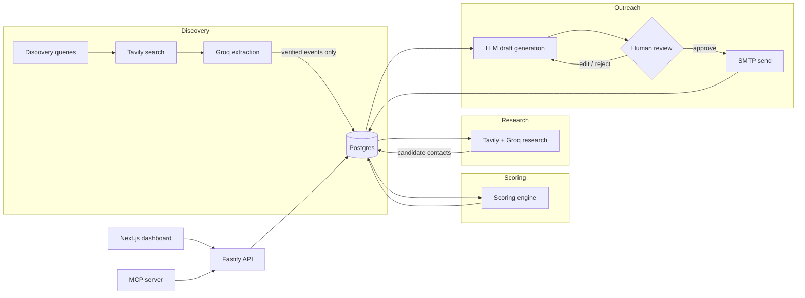

# Photography Outreach CRM

A CRM that finds paid photography work for you: it discovers real upcoming events, scores which ones are worth pitching, researches who to contact, drafts a personalized outreach email — and then **waits for you**. Nothing gets sent without a human clicking approve.

**Discover → Score → Research a contact → Draft an email → Human approves → Send → Track → Follow up.**

Live, working, zero-cost stack: event/contact discovery runs on Tavily's search API + Groq's inference API, both free tiers, no credit card. This is a standalone project — it does not import, modify, or depend on any other codebase.

---

## Why this project is interesting

This isn't a CRUD app with an AI wrapper bolted on. A few problems it actually had to solve:

- **LLMs are the wrong tool for "find me real information."** An LLM asked to "list upcoming concerts in Bengaluru" will confidently hallucinate venues and dates. The fix here: separate *retrieval* (a real search API) from *extraction* (an LLM that only restructures search results it was actually handed) — and then verify the LLM didn't cheat, by checking every claimed source URL against the literal set of URLs the search API returned. If the model cites a URL it wasn't given, that result is discarded, no exceptions. See [`packages/events/src/extraction.ts`](packages/events/src/extraction.ts).

- **Human-in-the-loop isn't just for the email.** It would be easy to let automated research auto-select "the best" contact and auto-attach it to a draft. This system deliberately doesn't: research surfaces *candidates*, and a person has to explicitly pick one — the same principle that governs sending. Two different automation layers (event discovery, contact research), one consistent rule: automation proposes, a human decides.

- **Idempotency as a design constraint, not an afterthought.** Every write path in this system is safe to retry: rerunning discovery never duplicates an event (exact-match *and* fuzzy dedup — same artist/venue/date via a different search query still merges), rerunning "generate draft" returns the existing draft instead of spamming new ones, and sending is backed by a real database unique constraint (`outreach.email_draft_id`) so a network retry can never send the same email twice — the guarantee holds even if the application-level check is bypassed.

- **A provider abstraction that's actually exercised, not just theoretical.** `EventProvider` and `ResearchProvider` each have real, independent implementations (Bandsintown's structured API vs. two different Tavily+Groq/OpenAI web-search approaches) proving the interface holds, not just one implementation dressed up behind an interface nobody else uses.

- **Free-tier constraints as real engineering constraints.** Building against free-tier rate limits (8,000 tokens/minute on Groq) forced real tradeoffs — result truncation, capped search breadth, explicit token budgets — that a paid-API version wouldn't have needed to think about at all.

---

## Architecture



Both the web dashboard and the MCP server call the exact same service layer (`packages/*`) — no business logic lives in the API routes or the MCP tool handlers themselves, only thin validation/wiring.

## Tech stack

| Layer | Choice |
|---|---|
| Monorepo | pnpm workspaces + Turborepo |
| Frontend | Next.js (App Router) |
| API | Fastify + zod |
| MCP server | `@modelcontextprotocol/sdk` (stdio) — 19 tools |
| Database | PostgreSQL + Prisma |
| Event/contact discovery | Tavily (search) + Groq (extraction) — free tier |
| Email generation | Anthropic / OpenAI / Groq, pluggable |
| Email sending | nodemailer via SMTP |
| Testing | Vitest — 62 unit/integration/e2e tests |

Full design rationale (schema, RAG decision, security model, phased roadmap) is in [`docs/architecture.md`](./docs/architecture.md).

## Repository layout

```
apps/
  web/    Next.js dashboard (login, opportunities, pipeline board, draft review, settings)
  api/    Fastify REST API + in-process cron jobs (daily discovery, follow-up checks)
  mcp/    MCP server exposing the same operations as tools (stdio transport)
packages/
  database/      Prisma schema, migrations, seed data
  events/        EventProvider abstraction — TavilyGroqEventProvider (default),
                 OpenAIWebSearchEventProvider, BandsintownProvider
  opportunities/ Scoring engine + pipeline state machine
  research/      ResearchProvider abstraction — WebsiteResearchProvider (Tavily+Groq)
                 plus manual contact entry; human always picks the contact to use
  ai/            LLMProvider abstraction (Anthropic/OpenAI/Groq) + outreach email prompt
  email/         SMTP sending, draft lifecycle (edit/approve/reject), follow-up scheduling
  rag/           Empty placeholder — see the RAG section of the architecture doc for why
  shared/        Logger, env validation, shared types/enums, error classes
tests/
  integration/   Fastify app tested via .inject() against a real test Postgres
  e2e/           Full discover → score → contact → draft → approve → send flow
```

## Prerequisites

- Node.js 20+
- pnpm (`corepack enable` or `npm install -g pnpm`)
- Docker (for local Postgres)
- A free [Tavily](https://tavily.com) API key (search) and a free [Groq](https://console.groq.com/keys) API key (extraction/drafting) — no credit card required for either
- Optionally, an Anthropic or OpenAI API key if you'd rather use one of those for outreach email generation instead of Groq
- A Gmail/Google Workspace account with 2-Step Verification enabled, to create an [App Password](https://myaccount.google.com/apppasswords)

## Setup

```bash
cp .env.example .env
# fill in .env: DATABASE_URL is already correct for the docker-compose Postgres below

pnpm install
docker compose up -d
pnpm db:migrate
pnpm db:generate
pnpm db:seed
```

Generate your admin login credentials before seeding if you want to log in immediately:

```bash
node -e "console.log(require('bcryptjs').hashSync('your-password', 10))"
# put the output in ADMIN_PASSWORD_HASH in .env, then re-run: pnpm db:seed
```

## Running

```bash
pnpm dev
```

Starts the API (`http://localhost:4000`) and the web dashboard (`http://localhost:3000`) together via Turborepo. Log in with `ADMIN_EMAIL` / the password you hashed above.

Run the MCP server standalone (e.g. to register it with an MCP-compatible client):

```bash
pnpm --filter @photography-outreach/mcp dev
```

## Testing

```bash
pnpm test          # unit tests across all packages (no external services needed)
pnpm db:migrate    # apply migrations to your local Postgres first, then:
pnpm --filter @photography-outreach/integration test
pnpm --filter @photography-outreach/e2e test
```

Unit tests mock external HTTP/LLM/SMTP calls. Integration and e2e tests need a real, migrated Postgres (the `docker-compose.yml` one is fine) but never call the real Tavily/Groq/SMTP services — those are mocked in-process.

## Walking through the flow manually

1. Add/edit discovery queries on the **Settings** page — each is a web-search query, e.g. "upcoming electronic music events in Bengaluru, India."
2. Click **Run event discovery** on the Dashboard.
3. Open a scored opportunity, read its score explanation.
4. Click **Find contacts** to run automated research, or add one manually — either way, you pick which contact to actually use.
5. Generate a draft, edit it if you want, approve it.
6. Send it — check the recipient's inbox for the real email.
7. Scroll the opportunity's activity timeline to see every step logged, unedited.

## Deployment

Split across three free-tier services (the API is a persistent server with a cron scheduler, so it doesn't fit a serverless/static host like Netlify on its own):

| Piece | Host | Why |
|---|---|---|
| `apps/web` | [Netlify](https://netlify.com) | Static/SSR hosting for Next.js — `netlify.toml` at the repo root already configures the build |
| `apps/api` | [Render](https://render.com) (free web service) | Needs a real, persistent Node process — `render.yaml` at the repo root is a ready-to-use blueprint |
| Postgres | [Neon](https://neon.tech) | Serverless Postgres, generous free tier |

Steps:

1. **Neon**: create a project, copy its connection string as `DATABASE_URL`.
2. **Render**: New → Blueprint → point at this GitHub repo (it'll detect `render.yaml`). Fill in the `sync: false` env vars in the dashboard (`DATABASE_URL` from step 1, your API keys, `ADMIN_EMAIL`/`ADMIN_PASSWORD_HASH`/`SESSION_SECRET`/`API_TOKEN`, SMTP creds) — see `.env.example` for what each does. After it deploys, run migrations against the Neon database from your machine: `DATABASE_URL="<neon-url>" pnpm --filter @photography-outreach/database exec prisma migrate deploy`, then seed it the same way.
3. **Netlify**: New site from Git → this repo (it'll detect `netlify.toml`). Set one environment variable: `NEXT_PUBLIC_API_BASE_URL` = your Render service's URL.
4. **Scheduled jobs**: Render's free tier sleeps after 15 minutes idle, which would silently stop the API's in-process cron jobs from firing. `.github/workflows/scheduled-jobs.yml` works around this for free — it pings the API on a schedule (which also wakes it up). Add two repo secrets under Settings → Secrets and variables → Actions: `API_BASE_URL` (your Render URL) and `API_TOKEN` (matching what you set in Render).

## Security notes

- Never commit `.env`. Copy `.env.example` and fill in real values locally only.
- The send path only ever fires for drafts in `approved` status, and a unique DB constraint makes a double-send impossible even under a retry.
- All external event/web content is wrapped and explicitly marked as untrusted data before it ever reaches an LLM prompt — see `packages/shared/src/security.ts`, `packages/ai/src/prompts/outreach-email.ts`, and `packages/events/src/extraction.ts`. Every discovered event or contact requires a real, verified source URL — for the default Tavily+Groq providers this is checked in code against the actual search results, not just requested by instruction, so the model cannot invent one.
- Automated research never bypasses authentication, CAPTCHAs, or paywalls — it only ever sees public search-result snippets.
